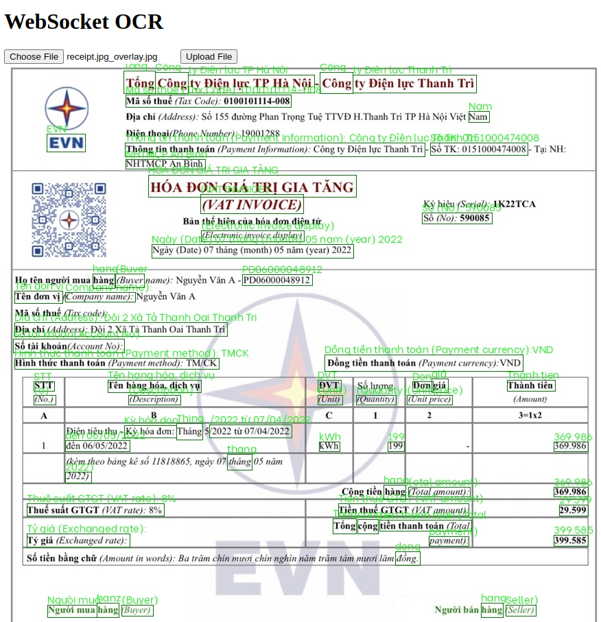

This tutorial with show you how to use WebSocket to make prediction in real time.

# How-to Guide

1. Open websocket server using the following command:
   ```shell
   python main.py
   ```
2. Open file `index.html` using any of your browsers (preferred Chrome)
3. Choose some `.jpg` or `.jpeg` files, and click `Upload File`,
   you will see the uploadded image displayed on the screen
   

# TODO

This is just a codebase and not yet implemented the OCR feature, please do it yourself, not hard ;).
