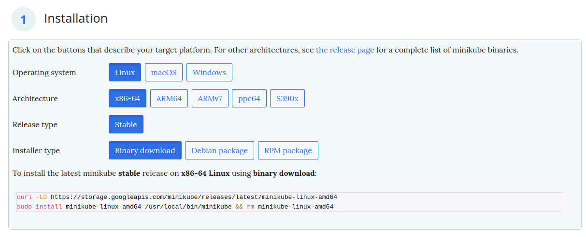

# How-to Guide

## 1. Prerequisites
Install `minikube` following [this tutorial](https://minikube.sigs.k8s.io/docs/start/?arch=%2Flinux%2Fx86-64%2Fstable%2Fbinary+download). Feel free to select another OS depending on you usecase (e.g., macOS)



Start your first cluster by running the following command
```shell
minikube start
```

If you want Minikube to use all of your computer resources, use the following command:
```shell
minikube start --cpu=max --memory=max
```

## Try basic k8s operations

```shell
kubectl apply -f pod.yaml
kubectl apply -f deployment.yaml
```

